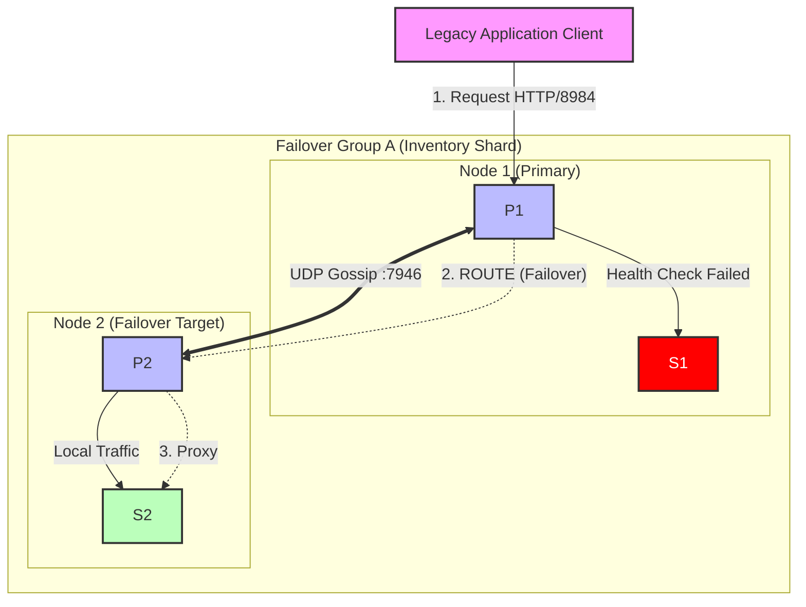

### Architecture Diagram

```mermaid
graph TD
    %% Styling
    classDef client fill:#f9f,stroke:#333,stroke-width:2px;
    classDef proxy fill:#bbf,stroke:#333,stroke-width:2px;
    classDef solr fill:#bfb,stroke:#333,stroke-width:2px;
    classDef dead fill:#f00,stroke:#333,stroke-width:2px,color:#fff;

    Client[Legacy Application Client]:::client

    subgraph "Failover Group A (Inventory Shard)"
        direction TB
        
        subgraph "Node 1 (Primary)"
            P1:::proxy
            S1:::dead
            P1 -- "Health Check Failed" --> S1
        end

        subgraph "Node 2 (Failover Target)"
            P2:::proxy
            S2:::solr
            P2 -->|Local Traffic| S2
        end
        
        %% Gossip Protocol
        P1 <==>|UDP Gossip :7946| P2
    end

    %% Traffic Flow
    Client -->|"1. Request HTTP/8984"| P1
    P1 -.->|"2. ROUTE (Failover)"| P2
    P2 -.->|"3. Proxy"| S2
```